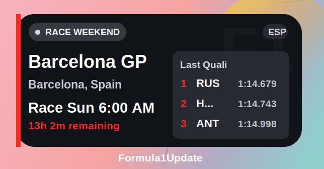

# Formula1Update

An iPhone app and WidgetKit widget for quick Formula 1 updates.

## What It Shows

- Next race and location
- Local start time for the next session
- Latest completed session result
- Small, medium, and large widget layouts

## Data

Powered by the OpenF1 API. Responses are cached locally to reduce API calls and avoid rate-limit issues during normal widget refreshes.

## Build

Open `Formula1Update.xcodeproj` in Xcode and run the `Formula1Update` scheme.
